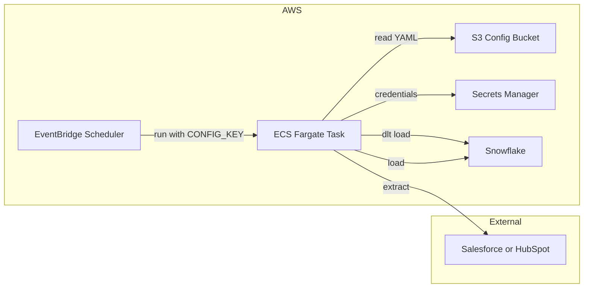

# serverless-mt-ingest

Multi-tenant, configuration-driven CRM data ingestion on AWS. Ingests from Salesforce and HubSpot into Snowflake (raw data as VARIANT), orchestrated by ECS Fargate and EventBridge Scheduler.

## Architecture



One EventBridge schedule exists per pipeline config (per tenant/source). Each run starts an ECS Fargate task with `CONFIG_KEY` set to the config path in S3. The task reads the YAML, fetches CRM and Snowflake credentials from Secrets Manager, runs the dlt pipeline, and exits.

## dlt (data load tool)

This project uses **[dlt](https://dlthub.com)** (data load tool) to run the actual pipelines:

- **Sources**: Salesforce, HubSpot via dlt verified sources.
- **Destination**: Snowflake; credentials and dataset/schema are config-driven, credentials stored in AWS Secrets Manager.

Pipeline config is YAML in S3; the ingest job reads config, resolves credentials from Secrets Manager, and runs the appropriate dlt source into Snowflake. Data is loaded with dlt’s normal typing; for VARIANT-style raw storage you can use Snowflake’s JSONL loader or add views as needed.

- [dlt docs](https://dlthub.com/docs)
- [Salesforce source](https://dlthub.com/docs/dlt-ecosystem/verified-sources/salesforce)
- [HubSpot source](https://dlthub.com/docs/dlt-ecosystem/verified-sources/hubspot)
- [Snowflake destination](https://dlthub.com/docs/dlt-ecosystem/destinations/snowflake)

## Prerequisites

- AWS account
- Terraform >= 1.x
- Docker (for building the ingest job image)
- Python 3.12+ with `uv` (for local development)
- Snowflake account (for destination)

## Project structure

- `terraform/` – AWS infrastructure (S3, ECS, EventBridge Scheduler, IAM for Secrets Manager)
- `ingest_job/` – Python job that reads config from S3 and runs dlt pipelines (Salesforce, HubSpot → Snowflake)
- `docs/` – [Architecture](docs/architecture.md) and runbooks

## Deploy

1. Copy `.env.example` to `.env` and set `TF_VAR_project_name`, `TF_VAR_ingest_job_image` (after building), and list variables via a `terraform/terraform.tfvars` file (see `terraform/terraform.tfvars.example`): `ecs_subnet_ids`, `ecs_security_group_ids`.
2. Build and push the ingest job image to ECR (see `ingest_job/README.md`).
3. From `terraform/`: `terraform init`, `terraform plan`, `terraform apply`.
4. Upload pipeline configs to the S3 config bucket:  
   `aws s3 cp terraform/configs/tenants/ s3://$(terraform -chdir=terraform output -raw s3_config_bucket)/tenants/ --recursive`
5. Create secrets in AWS Secrets Manager for each pipeline (Salesforce, HubSpot, Snowflake) and set `credentials_ref` in the YAML to the secret name or ARN.

## Run a pipeline ad hoc

To trigger a single run without waiting for the schedule:

```bash
aws ecs run-task \
  --cluster $(terraform -chdir=terraform output -raw ecs_cluster_name) \
  --task-definition $(terraform -chdir=terraform output -raw ecs_task_definition_family) \
  --launch-type FARGATE \
  --network-configuration "awsvpcConfiguration={subnets=[subnet-xxx,subnet-yyy],securityGroups=[sg-zzz],assignPublicIp=ENABLED}" \
  --overrides '{"containerOverrides":[{"name":"ingest","environment":[{"name":"CONFIG_KEY","value":"tenants/example/salesforce.yaml"}]}]}'
```

Use your actual subnet IDs, security group IDs (e.g. from `terraform.tfvars`), and the desired `CONFIG_KEY` value.

## Adding a tenant

1. Add a YAML file under `terraform/configs/tenants/<tenant_id>/` (e.g. `salesforce.yaml`, `hubspot.yaml`). Include `pipeline_name`, `schedule` (5-field cron, e.g. `0 6 * * *`), `source`, and `destination` with `credentials_ref` pointing to Secrets Manager.
2. Run `terraform apply` so EventBridge Scheduler creates a schedule for the new config.
3. Upload the new config to S3: `aws s3 cp terraform/configs/tenants/<tenant_id>/<file>.yaml s3://<bucket>/tenants/<tenant_id>/`.
4. Create the required secrets in AWS Secrets Manager (Salesforce: `user_name`, `password`, `security_token`; HubSpot: `access_token` or `api_key`; Snowflake: connection credentials) and reference them in the config.

## Scaling

- **Many tenants**: One config file and one EventBridge schedule per pipeline; Fargate runs one task per invocation. Add more configs and apply Terraform; no code change.
- **Concurrency**: Limited by ECS/Fargate account quotas (raise limits if needed). Tasks are independent; no shared state.
- To reduce the number of EventBridge schedules, you can use a single schedule with a Lambda that enumerates configs and invokes ECS per config; the current design keeps one schedule per config for simplicity and clear visibility in the AWS console.
